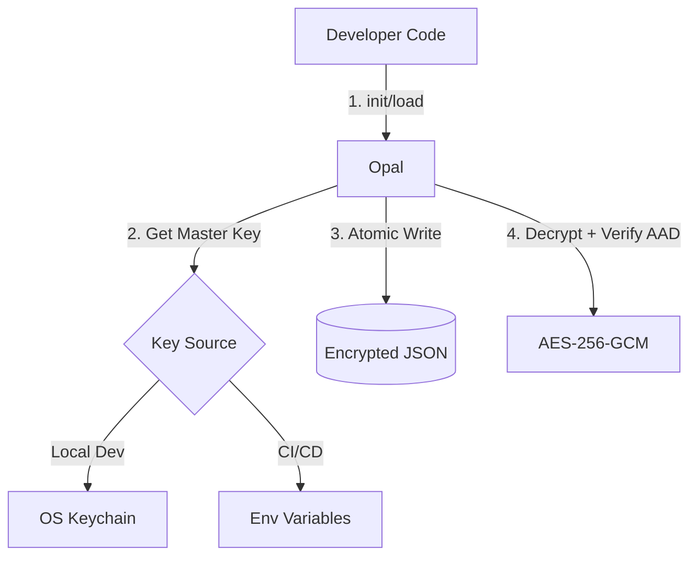

### 📄 1. RFC-001: Specification (Updated)

*Eklenenler: Env Var Value Format, `getAll()` metodu.*

# RFC-001: Opal (SolidState) Secure Store Specification

| Metadata | Details |
| :--- | :--- |
| **Project** | Opal (Codename: SolidState) |
| **Version** | 1.0.1 (Final) |
| **Status** | Approved |
| **Type** | Standards Track |
| **Author** | Erdem Arslan |

## 1. Abstract
Opal is a secure, atomic, hybrid configuration store for Node.js CLI and desktop applications. It enforces an explicit lifecycle to prevent data loss and uses AES-256-GCM for integrity.

## 2. Architecture

## 3. Security Specification

### 3.1 Cryptographic Primitives

* **Algorithm:** `AES-256-GCM`
* **Master Key:** 256-bit (32 bytes).
* **IV (Nonce):** 96-bit (12 bytes). Compliant with NIST SP 800-38D.
* **Auth Tag:** 128-bit (16 bytes).
* **AAD (Context):** Mandatory `appName` binding.

### 3.2 Key Management Standards

* **Local Storage:** OS Keychain via `@napi-rs/keyring`.
* **CI/CD Storage:** Environment Variables.
* **Env Var Value Format:** Must be a **64-character Hexadecimal String** (representing 32 bytes).
  * *Example:* `a1b2c3d4... (64 chars)`
  * *Validation:* Application must throw `OPAL_INVALID_KEY` if length != 64 or content is not hex.

### 3.3 Atomicity

* **Atomic Writes:** "Write-to-Temp" + "Rename" strategy.

## 4. API Lifecycle

* `init()`: Generates new key. Throws if key exists.
* `load()`: Loads data. Throws if key missing. Never auto-generates.
* `get(key)`: Retrieves specific value.
* `getAll()`: Retrieves entire config object (Shallow copy).
* `set(key, value)`: Encrypts and persists immediately.
* `delete(key)`: Removes key and persists immediately.

## 5. Error Codes

| Error Code | Description |
| --- | --- |
| `OPAL_KEY_NOT_FOUND` | No master key found. |
| `OPAL_ALREADY_INIT` | Store already initialized. |
| `OPAL_NOT_LOADED` | Access attempt before `load()`. |
| `OPAL_INVALID_KEY` | Env var key is not 64 hex chars. |
| `OPAL_INTEGRITY_FAIL` | Decryption/AAD check failed. |
